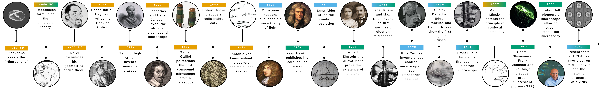

# 1 - What is light?

:::{raw} html

  

:::

Diffraction
---
Diffraction can be defined as “any deviation of a light ray from rectilinear propagation, which is not caused by reflection nor refraction”.
It was already known for centuries that light rays passing through a small aperture in an opaque screen do not form a sharp shadow on a distant screen. That smooth transition from light to shadow could only be explained by assuming that light has a wavelike character.
