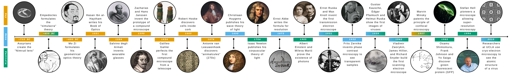

# A historical journey

The story of how we learned to see beyond the limits of the naked eye is one of the most fascinating in all of science. It spans more than two millennia of curiosity, ingenuity and (let's be honest) stubbornness. What follows is not an exhaustive account, but a selection of the milestones that shaped the field and that will come back throughout this book. Feel free to use this section as a reference when you encounter a name or a technique in later chapters and wonder where it all started.

:::{raw} html
<div style="overflow-x:auto; width:100%; text-align:center;">
  
</div>
:::

### Ancient foundations

Our relationship with optics is older than you might think. Around 700 BCE, Assyrian craftsmen polished a piece of rock crystal into what we now call the **Nimrud lens**, discovered in the ruins of an ancient palace near modern-day Mosul, Iraq. It is a small, unassuming object, roughly the size of a coin, but it represents something significant: evidence that ancient people already understood, at least empirically, that curved transparent materials could bend light. Whether it was used as a magnifying glass, a burning lens to start fires, or simply a decorative curiosity is still debated. What is certain is that it is humanity's earliest known attempt at manipulating light for a purpose.

```{figure} ../figures/nimrud_lens.jpg
---
width: 50%
name: nimrud
align: center
---
Photo of the nimrud lens in the British Museum. Copyright: Geni, CC BY-SA 4.0, via Wikimedia Commons
```


The ancient Greeks turned optics into philosophy. Around 450 BCE, Empedocles of Acragas proposed his "simulacra theory" of vision: all objects, he argued, continuously emit tiny copies of themselves that travel through the air and enter the eye, where they interact with an "inner fire" emanating from the observer. The theory was wrong, of course, but it contained a genuinely important idea: the recognition that vision requires _something_ to travel between object and observer.

Meanwhile, around 400 BCE and halfway across the world, the Chinese philosopher Mo Zi and his followers were taking a more experimental approach. In the *Mohist Canon*, they documented observations on the camera obscura, on how shadows form, and on the principle that light travels in straight lines. They noted, for example, that light from the top of an object passing through a pinhole appears at the bottom of the projected image, and vice versa. This geometric analysis of light propagation anticipated European developments by nearly two thousand years.

### The Islamic Golden Age and medieval optics

The next major leap came from the Arab polymath **Ibn al-Haytham** (known in the West as Alhazen), who completed his monumental seven-volume *Book of Optics* (*Kitab al-Manazir*) around 1021 CE. This work was revolutionary on multiple levels. Ibn al-Haytham demonstrated experimentally that light travels _from_ objects _to_ the eye, overturning centuries of emission theories. He analyzed reflection and refraction with mathematical rigor, studied the anatomy of the eye, investigated phenomena like rainbows and twilight, and explained the workings of the camera obscura. Perhaps most importantly, his insistence on combining experimental evidence with mathematical description established a methodology that we would now call scientific. The Latin translation of his book, circulated from the 13th century onward, profoundly influenced European scholars for generations.

```{figure} ../figures/Ibn_al-Haytham.png
---
width: 50%
name: ibnalhaytham
align: center
---
Ibn al-Haytham. Copyright: Sopianwar, CC BY-SA 4.0, via Wikimedia Commons
```

On the more practical side, around 1284, the Italian craftsman Salvino degli Armati (though the exact attribution is historically debated) is credited with creating some of the first wearable spectacles: convex lenses mounted in a frame that rested on the nose, correcting presbyopia. This seemingly modest invention had a far-reaching consequence that nobody could have anticipated: the proliferation of spectacle makers across Europe created a community of skilled lens grinders. These craftsmen, honing their art over generations, would be the very people who later built the first microscopes and telescopes.

### The first microscopes

By 1590, in the Dutch town of Middelburg, spectacle makers Zacharias and Hans Janssen assembled what many historians consider the first compound microscope. Their idea was simple but powerful: place a convex objective lens at one end of a tube and a convex eyepiece at the other, so that the magnification of one lens amplifies the other. The images they obtained were blurry and plagued by colored fringes, but the underlying concept was transformative: lenses could be combined to reveal things invisible to the naked eye.

Around 1609, Galileo Galilei, already famous for pointing his telescope at the heavens, turned his attention downward to the miniature. By reversing the optics of his telescope, he built an early compound microscope he called the *occhiolino* ("little eye"), achieving about 30× magnification. Galileo used it to examine insects and described the instrument with genuine enthusiasm, writing that it revealed "wonderful sights" in the tiny world. While he is rightfully celebrated for his astronomical discoveries, Galileo demonstrated something equally important: that optical instruments could open hidden worlds at both cosmic and microscopic scales.

The real breakthrough in microscopy, however, came in 1665 when the English polymath **Robert Hooke** published *Micrographia*. The book was a sensation. Using an improved compound microscope and clever illumination (he used a water-filled glass flask as a condenser to focus lamplight onto his specimens), Hooke produced breathtaking engravings of the compound eyes of flies, the barbs of feathers, the stinger of a bee, and much more. The level of detail was unlike anything the public had seen before.

But Hooke's most consequential observation was almost accidental. While examining thin slices of cork, he noticed a honeycomb-like pattern of tiny, regular compartments. They reminded him of the small rooms ("cells") in a monastery. He had just coined one of the most important terms in biology. What Hooke was actually seeing were the dead cell walls left behind in the cork tissue, not living cells, but he had unknowingly stumbled upon the basic unit of life. *Micrographia* showed that microscopy could be both scientifically groundbreaking and accessible to the general public, and it inspired a generation of naturalists to look more closely at the world around them.

```{figure} ../figures/hooke.png
---
width: 90%
name: hooke
align: center
---
Illustrations of the microstructure of cork, hair, and silks, taken from *Micrographia*. Copyright: CC BY 4.0, via Wikimedia Commons
```

Around the same time, an unlikely figure was about to revolutionize the field. **Antonie van Leeuwenhoek**, a Dutch draper and tradesman from Delft with no formal scientific training, had an extraordinary talent for grinding and polishing tiny glass lenses. His approach was the opposite of the compound microscope: instead of stacking imperfect lenses, he crafted _single_ lenses so small (some less than 2 mm in diameter) and so precisely shaped that they achieved over 270× magnification with remarkable clarity. He built hundreds of these simple microscopes over his lifetime, each one dedicated to a particular specimen, and guarded his lens-making techniques jealously, taking them to his grave.

```{figure} ../figures/van-leeuwenhoeck.png
---
width: 50%
name: van-leeuwenhoeck
align: center
---
A model of the microscope created by Antonie van Leeuwenhoek. The microscope used a glass bead as a magnifier, giving a much greater magnification than other types of lenses available at the time. Copyright: Mark Cartwright, CC BY-NC-SA, via Science Museum, London
```

Through these instruments, van Leeuwenhoek became the first human to observe an entirely new realm of life. In 1676, examining water from a nearby lake, he described tiny creatures swimming and rotating with purposeful motion, which he called "animalcules" (little animals). He was looking at bacteria, protists and other microorganisms, millions of times smaller than any creature known at the time. Over the following decades, he went on to discover spermatozoa, red blood cells, the striations in muscle tissue, and bacteria from his own mouth. For nearly fifty years, he communicated his findings to the Royal Society of London in hundreds of letters written in Dutch, accompanied by his own meticulous drawings. Van Leeuwenhoek proved that life existed at scales far beyond what anyone had imagined.

### The nature of light debated

As microscopy was revealing these new worlds, natural philosophers were wrestling with a question essential to improving optical instruments: what _is_ light?

In 1690, the Dutch physicist **Christiaan Huygens** published his *Treatise on Light*, in which he proposed that light propagates as waves through a hypothetical medium (the "luminiferous ether"). He articulated what became known as Huygens' principle: every point on a wavefront serves as a source of secondary spherical wavelets, and the envelope of these wavelets forms the new wavefront. This principle, which we will revisit in detail in {ref}`Chapter 6 <chap6_1>`, elegantly explained reflection, refraction and the mysterious double refraction observed in calcite crystals. It remains a cornerstone of physical optics to this day.

Not everyone was convinced. In 1704, **Isaac Newton** published *Opticks*, describing his extensive experiments with prisms and color. Newton's experiments were brilliant: he demonstrated that white light is composed of all colors of the spectrum, investigated thin-film interference (Newton's rings), and analyzed the properties of light with characteristic thoroughness. Yet, based on light's apparently straight-line propagation and the sharpness of shadows, he favored a corpuscular theory: light, he argued, consists of tiny particles emitted by luminous objects.

Newton's enormous authority made the corpuscular theory dominant in Britain for over a century, while continental European scientists generally preferred Huygens' wave picture. The full resolution of this debate would have to wait for quantum mechanics, which would reveal that both sides were capturing different aspects of a deeper and more surprising reality.

### Abbe and the diffraction limit

The 19th century brought a crucial theoretical advance that sets the stage for everything that follows in this book. In 1874, **Ernst Abbe**, a German physicist working with the optical manufacturer Carl Zeiss in Jena, published his theory of image formation in the microscope, from which he derived his famous resolution formula:

$$
d = \frac{\lambda}{2 \cdot \text{NA}}
$$

This deceptively simple equation states that the smallest detail $d$ that a microscope can resolve is set by the wavelength of light $\lambda$ and the numerical aperture of the objective (NA). No matter how perfectly lenses are ground or how high the magnification, an optical microscope using visible light cannot distinguish features smaller than roughly 200 nm. This **diffraction limit** is not an engineering shortcoming; it is a fundamental consequence of the wave nature of light itself.

Abbe's insight transformed microscope design from an empirical craft into a rigorous science grounded in physical principles. Together with Zeiss and the glassmaker Otto Schott, he developed new optical glasses and objective designs that pushed performance toward the theoretical maximum. But his work also carried an uncomfortable message: breaking this barrier would require either shorter wavelengths or entirely new ideas. Both paths would eventually be taken.

```{figure} ../figures/abbe_stone.jpg
---
width: 80%
name: abbestone
align: center
---
The resolution limit formula engraved in an Ernst Abbe memorial in Jena, Germany. Copyright: Daniel Mietchen, CC0, via Wikimedia Commons
```

### Waves, particles, and electrons

In 1905, **Albert Einstein** and his first wife **Mileva Marić** explained the photoelectric effect by proposing that light also behaves as discrete packets of energy called photons, each carrying energy $E = hf$ proportional to its frequency. The photoelectric effect had puzzled physicists: increasing the intensity of light did not increase the energy of ejected electrons, and below a certain threshold frequency no electrons were ejected at all, regardless of intensity. The photon hypothesis explained all of this elegantly: electrons are knocked out when individual photons transfer enough energy, determined by frequency rather than intensity.

This work earned Einstein the 1921 Nobel Prize in Physics (contrary to popular belief, not for relativity). Mileva Marić, a physicist and mathematician who had studied alongside Einstein at the Zurich Polytechnic, received no recognition. She was one of the very few women admitted to the physics and mathematics program at the time, and her intermediate exam grades in physics matched Einstein's. Yet she failed the final diploma examinations twice, the second time while three months pregnant with their daughter, and never obtained her degree. She had planned to develop her diploma research into a PhD thesis, but abandoned that path after the second failure. Marriage, motherhood and eventually divorce removed her from academic life entirely.
The extent of Marić's intellectual contribution to the 1905 papers remains a matter of debate among historians. Early letters between the two refer to "our work" and "our theory," and Marić herself reportedly told a friend that "we finished some important work that will make my husband world famous." Some scholars interpret these as signs of genuine collaboration, while others argue that they reflect the language of a couple sharing their lives rather than co-authorship. What is beyond dispute is that Marić was a trained physicist who served as an intellectual companion during Einstein's most creative period, and that the academic and social structures of the time made it virtually impossible for a woman in her position to receive credit for any contribution she may have made. Her story is a reminder that the history of science, as it has been written, is not always the full story.

```{figure} ../figures/einsteinmaric.jpg
---
width: 50%
name: einsteinmaric
align: center
---
Albert Einstein and his first wife Mileva Maric. Copyright: Public domain
```

The wave nature of _particles_, in turn, opened a new door for microscopy. Around 1931, **Ernst Ruska** and Max Knoll at the Technical University of Berlin built the first transmission electron microscope (TEM). Quantum mechanics had shown that electrons, too, behave as waves, but with wavelengths thousands of times shorter than visible light. By focusing electrons with magnetic "lenses" (electromagnetic coils that bend electron paths), the TEM could in principle achieve magnifications of hundreds of thousands of times, revealing structures far beyond the reach of any light microscope. The first instruments were modest, but improvements came rapidly.

In 1939, Gustav Kausche, Edgar Pfankuch and **Helmut Ruska** (Ernst's younger brother, who had turned his attention to biological applications) used the TEM to capture the first images of a virus: tobacco mosaic virus (TMV), revealed as rod-shaped particles about 300 nm long and 15 nm in diameter. Viruses had been hypothesized to exist since the 1890s based on their disease-causing properties and their ability to pass through filters that blocked bacteria, but they had never been directly observed. Were they the smallest living organisms? Chemical agents with infectious properties? Something in between? The electron microscope images settled the question by showing that viruses are discrete physical particles with defined shapes and sizes, existing at the boundary between living and non-living matter.

```{figure} ../figures/tmv.jpg
---
width: 50%
name: tmv
align: center
---
Electron microscopy image of the tobacco mosaic virus (TMV). It exclusively infects plants, but has significant economic implications. It is the cause of mosaic disease in tobacco, which also affects other agricultural crops such as tomatoes and bell peppers. Copyright: Public domain
```

### Seeing surfaces and seeing living cells

While the TEM revealed internal structures by passing electrons through thin specimens, examining surfaces required a different strategy. In 1938, Ernst Ruska developed the first scanning electron microscope (SEM), though fully practical instruments only emerged in the 1960s. The SEM works by scanning a focused electron beam across a specimen's surface and detecting the secondary electrons emitted from each point. The result is an image showing surface topography with striking three-dimensional appearance and remarkable depth of field. Where the TEM excelled at revealing internal ultrastructure, the SEM provided vivid views of surfaces: the compound eyes of insects, the spines of pollen grains, the fractures in materials. Together, the two instruments transformed not only biology but also materials science, forensics and semiconductor manufacturing. Ernst Ruska received the Nobel Prize in Physics in 1986, more than five decades after his original invention.

Electron microscopy, however powerful, came with a fundamental tradeoff: samples had to be killed, fixed, dehydrated and placed in vacuum. Observing living cells was out of the question.

The solution came from a different approach entirely. In the 1930s, the Dutch physicist **Frits Zernike** developed **phase contrast microscopy**. The idea exploited a subtle property of light: when light passes through different parts of a transparent cell (nucleus, cytoplasm, organelles), it travels at slightly different speeds, producing tiny phase shifts. Our eyes cannot detect phase, only amplitude (brightness), so transparent cells appear virtually invisible under a standard microscope. Zernike's insight was to design an optical system that converts these invisible phase differences into visible brightness differences. The result was transformative: for the first time, living, unstained cells could be observed in detail, and dynamic processes like cell division could be followed in real time without killing the specimen. Zernike received the 1953 Nobel Prize in Physics for this contribution.

### Confocal microscopy and optical sectioning

In 1957, **Marvin Minsky**, a young Harvard professor who would later become one of the founders of artificial intelligence, patented the principle of the confocal microscope. The problem he addressed was fundamental: in conventional microscopy, when you look at a thick sample, light coming from above and below the focal plane creates a haze that obscures the structures you are interested in.

Minsky's solution was elegant: illuminate only a single point in the sample and place a pinhole aperture in front of the detector, positioned such that only light originating from the focal plane can pass through. Out-of-focus light, arriving from different angles, is blocked. This "confocal" arrangement (the illumination and detection are focused on the same point) enables **optical sectioning**: the ability to image thin slices through a thick specimen and reject everything above and below.

The concept, however, was ahead of its time. Practical confocal microscopes required bright point illumination (lasers), sensitive detectors, precise scanning mechanisms and computers fast enough to store and reconstruct optical sections. All of these became available by the 1980s and 1990s, and confocal microscopy quickly became one of the most important tools in cell biology, neuroscience and developmental biology.

### Green fluorescent protein

In 1962, **Osamu Shimomura**, Frank Johnson and Yo Saiga were studying a seemingly niche question: why does the jellyfish *Aequorea victoria* glow when disturbed in the waters of Puget Sound? They discovered that the jellyfish produces a protein, green fluorescent protein (GFP), which absorbs blue light and emits bright green fluorescence. The bioluminescence itself came from a different protein (aequorin), but GFP acted as the visible output. At the time, it seemed like little more than a biochemical curiosity.

The revolution took three decades to arrive. In the 1990s, molecular biologists realized that they could genetically fuse GFP to any protein of interest. By inserting the gene for GFP alongside the gene for a target protein, cells would produce a hybrid molecule carrying its own built-in fluorescent label. Suddenly, specific proteins could be watched as they moved through living cells, gene expression could be monitored in real time, and neural connections could be traced in transparent organisms. Researchers developed color variants (blue, cyan, yellow, red), enabling simultaneous tracking of multiple targets. Cells became self-illuminating. Shimomura, Martin Chalfie and Roger Tsien shared the 2008 Nobel Prize in Chemistry for this discovery and its development.

```{figure} ../figures/aequorea.png
---
width: 50%
name: aequorea
align: center
---
Aequorea victoria, also sometimes called the crystal jelly, is a bioluminescent hydrozoan jellyfish, or hydromedusa, that is found off the west coast of North America. The species is best known as the source of aequorin (a photoprotein), and green fluorescent protein (GFP), two proteins involved in bioluminescence. Their discoverers, Osamu Shimomura and colleagues, won the 2008 Nobel Prize in Chemistry for their work on GFP. Copyright: CC BY 4.0, via Animalia.Bio
```


### Breaking the diffraction limit

For over a century after Abbe's formula, the roughly 200 nm resolution barrier seemed absolute: a law of physics, not an engineering problem. Then, in the 1990s and 2000s, **Stefan Hell** and others showed that this was not quite the case.

Hell's key insight, implemented in STED (Stimulated Emission Depletion) microscopy, was subtle but profound: while diffraction limits how tightly light can be _focused_, it does not limit how precisely the _position_ of a fluorescent molecule can be _determined_. By using one laser to excite fluorescence and a second, donut-shaped laser to suppress it everywhere except a tiny central spot, Hell achieved effective resolutions of 20 to 50 nm with visible light. Other approaches, such as PALM (Photoactivated Localization Microscopy) and STORM (Stochastic Optical Reconstruction Microscopy), took a different route: they activated only a sparse subset of fluorescent molecules at a time, localized each one with high precision, and built up a super-resolved image from thousands of individual localizations.

These techniques were revolutionary because they combined the molecular specificity of fluorescence microscopy with resolution approaching that of electron microscopy, all while keeping cells alive. Hell shared the 2014 Nobel Prize in Chemistry for this work.

### Seeing atoms

The timeline culminates with cryo-electron microscopy (cryo-EM). The technique, pioneered in the 1970s, involves freezing biological samples so rapidly (plunging them into liquid ethane at -180°C) that water forms vitreous ice rather than damaging crystals. This preserves structures in their native, hydrated state. By imaging these frozen specimens with electron beams and computationally combining thousands of images to average out noise, researchers can reconstruct three-dimensional structures at near-atomic resolution, without the need for crystallization.

Over the decades that followed, cryo-EM underwent what is often called a "resolution revolution," driven by better electron detectors, more powerful computers and improved reconstruction algorithms. By the 2010s, the technique routinely achieved atomic resolution, allowing researchers to determine the structure of viruses and protein complexes atom by atom. Jacques Dubochet, Joachim Frank and Richard Henderson received the 2017 Nobel Prize in Chemistry for developing this capability.

```{figure} ../figures/nuclearpore.jpg
---
width: 90%
name: nuclearpore
align: center
---
The nuclear pore complex is a giant protein assembly that penetrates the double layers of the nuclear membrane. The great size and complexity of the NPC have hindered the study of its structure for many years until recent breakthroughs were achieved by integrating the latest high-resolution cryo-electron microscopy and artificial intelligence modeling. Copyright: CC BY-NC 4.0, via Journal of Molecular Biology, Tai et al. (2023)
```

### Today

Modern microscopy is no longer about a single instrument; it is about combining techniques. Researchers routinely switch between super-resolution fluorescence microscopy to watch molecules in living cells, cryo-EM to determine their atomic structures, and light-sheet imaging to capture 3D movies of developing embryos with minimal photodamage. Correlative microscopy bridges these worlds, allowing the same cell to be imaged first by fluorescence and then by electron microscopy.

Artificial intelligence is becoming an integral part of the field: denoising images, accelerating data acquisition, predicting structures from limited data, and tracking thousands of molecules simultaneously. Expansion microscopy takes an entirely different approach, physically swelling specimens with hydrogels so that structures originally too close to resolve become separated in space.

The frontier is shifting toward _in vivo_ molecular imaging, quantum microscopy using entangled photons, and holographic techniques that reconstruct 3D volumes from single exposures. The diffraction limit that Abbe identified in 1874 keeps falling to new tricks, and computational methods continue to extract information that seemed permanently lost.

The ancient quest to see the invisible continues, now limited less by the physics of light than by our ingenuity in asking what to look for.
