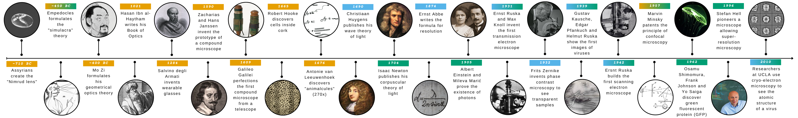

# 1 - A historical journey

The story of how humanity learned to see beyond the limits of the naked eye is one of the most remarkable chapters in scientific history. From ancient philosophical musings about the nature of light to the modern ability to visualize individual viruses, this journey spans more than two millennia of human curiosity, ingenuity, and perseverance.

:::{raw} html

  

:::

### Ancient foundations: light and geometry
Our timeline begins around 300 BCE with Euclid, the father of geometry, whose work laid the mathematical foundations for understanding how light travels. His treatise Optics proposed that vision occurred through rays emanating from the eye—a theory that, while incorrect, demonstrated the first systematic attempt to describe visual phenomena geometrically. Euclid's geometric principles would prove essential for understanding the behavior of lenses and mirrors centuries later.
The progression continued through the medieval Islamic world, where scholars preserved and expanded upon classical knowledge. Around 1021 CE, Ibn al-Haytham (known in the West as Alhazen) revolutionized optical science with his Book of Optics. Contradicting the ancient emission theory, he demonstrated that light travels from objects to the eye, not the reverse. His experimental approach to studying light, lenses, and vision established him as one of history's first true experimental physicists.

### From theory to practice
The Renaissance brought an explosion of practical optical innovation. In 1268, Roger Bacon described the magnifying properties of glass spheres and lenses, anticipating their future use in correcting vision and augmenting human sight. His writings hinted at the possibility of instruments that could make distant objects appear near—a prescient vision of the telescope.
By 1590, Zacharias and Hans Janssen, Dutch spectacle makers, had assembled what many consider the prototype of the compound microscope. By stacking lenses in a tube, they achieved magnifications far beyond what single lenses could provide, though their instruments were crude by modern standards.
The early 17th century marked a turning point. In 1608, Hans Lippershey applied for a patent on a device for seeing distant objects—effectively inventing the telescope. Though he may not have been the sole inventor, his contribution catalyzed a revolution in astronomy and optics.

Galileo Galilei seized upon the telescope's potential, and by 1610 he had perfected his own version, turning it skyward to discover Jupiter's moons, the phases of Venus, and mountains on our own Moon. These observations shattered the Aristotelian cosmos and demonstrated the power of optical instruments to reveal hidden truths about nature.
While Galileo looked to the heavens, others turned their attention to the infinitesimally small. In 1665, Robert Hooke published Micrographia, a lavishly illustrated volume documenting his microscopic observations. His detailed engravings of insects, plants, and minerals captivated the public imagination. Most significantly, while examining cork, Hooke observed tiny compartments he called "cells"—unknowingly discovering the fundamental unit of life.
That same year, Francesco Grimaldi published his observations of light diffraction, noting that light bends around obstacles and doesn't travel in perfectly straight lines as geometric optics suggested. This phenomenon would later prove crucial to understanding the wave nature of light.
Around 1674, Antonie van Leeuwenhoek, a Dutch tradesman with extraordinary skill in lens grinding, constructed simple microscopes of unprecedented power. Despite using only a single lens, his instruments achieved magnifications exceeding 200×. Through these remarkable devices, he became the first human to observe bacteria, protists, spermatozoa, and blood cells—an entire microscopic world of "animalcules" invisible to previous generations.

### Understanding light itself
As microscopy revealed new worlds, natural philosophers worked to understand the fundamental nature of light. In 1678, Christiaan Huygens proposed that light travels as waves, publishing his wave theory that could elegantly explain reflection, refraction, and the mysterious phenomenon of double refraction in certain crystals. His principle—that every point on a wavefront serves as a source of secondary wavelets—remains fundamental to modern optics.
The 18th century brought refinement and theory. In 1704, Isaac Newton published Opticks, describing his experiments with prisms and color. Though Newton himself favored a corpuscular theory of light, his meticulous experimental work on dispersion and color laid groundwork for future optical instruments. His contemporary understanding of light's properties informed the design of better achromatic lenses.

### The wave-particle revolution
The 19th century witnessed profound developments in understanding light and exploiting its properties. In 1801, Thomas Young performed his famous double-slit experiment, providing compelling evidence for the wave nature of light through the observation of interference patterns. This work helped establish the wave theory over Newton's corpuscular model.
By 1814, Joseph von Fraunhofer had discovered dark lines in the solar spectrum and invented the spectroscope, opening new avenues for analyzing light and matter. His work on diffraction gratings and precise optical measurements established standards for scientific instrument making.
In 1830, Joseph Jackson Lister made a crucial breakthrough in microscope design by determining how to combine lenses to eliminate spherical aberration—a persistent problem that had limited microscope resolution. His achromatic microscope objectives transformed microscopy from a curiosity into a reliable scientific tool.
The wave theory of light achieved its crowning achievement in 1864 when James Clerk Maxwell published his equations unifying electricity, magnetism, and light. Maxwell demonstrated mathematically that light is an electromagnetic wave, synthesizing seemingly disparate phenomena into one elegant framework. This theoretical triumph would later enable technologies from radio to modern optical communications.
As the 20th century dawned, physics underwent revolutionary upheaval. In 1905, Albert Einstein proposed that light, while exhibiting wave properties, also behaves as discrete packets of energy—photons. His explanation of the photoelectric effect demonstrated that light has a particle-like character, earning him the Nobel Prize and helping launch quantum mechanics. Paradoxically, light is both wave and particle, depending on how we observe it.
That same year, Richard Zsigmondy invented the ultramicroscope, which used scattered light to visualize particles smaller than the wavelength of light itself—previously thought impossible to see. This technique made visible colloidal gold particles and other nanoscale objects.
In 1924, August Köhler and Max von Siedentopf developed the ultraviolet microscope, exploiting shorter wavelengths to achieve better resolution than visible light microscopes. Shortly after, Ernst Ruska and Max Knoll invented the first transmission electron microscope in 1931, using electron beams instead of light to achieve magnifications of hundreds of thousands of times—finally making viruses visible.

### Modern microscopy
The latter 20th century brought innovations that would have seemed like magic to earlier microscopists. In 1938, Erwin Wilhelm Müller demonstrated the field emission microscope, which could visualize individual atoms on metal surfaces—approaching the ultimate limit of microscopic vision.
The development of phase contrast microscopy by Frits Zernike in 1942 allowed scientists to observe transparent, living cells without staining them, revolutionizing cell biology. This technique exploited subtle differences in how light travels through different cellular structures.
In 1957, Marvin Minsky patented the confocal microscope principle, though practical implementations would wait for laser technology to mature. Confocal microscopy eventually enabled three-dimensional imaging of biological specimens with unprecedented clarity.
Perhaps no single innovation has impacted biology more profoundly than the 1962 discovery of green fluorescent protein (GFP) by Osamu Shimomura and Frank Johnson. Isolated from jellyfish, GFP could be genetically attached to specific proteins, allowing scientists to watch molecular processes unfold in living cells—turning cells into self-illuminating beacons revealing their inner workings.
The timeline culminates in 1976 with a achievement that would have astounded van Leeuwenhoek: researchers at UCLA used cryo-electron microscopy to visualize the structure of viruses. By freezing samples rapidly and imaging them with electron beams, scientists could finally see these entities that had long existed at the very edge of the visible world—bridges between the living and the chemical.